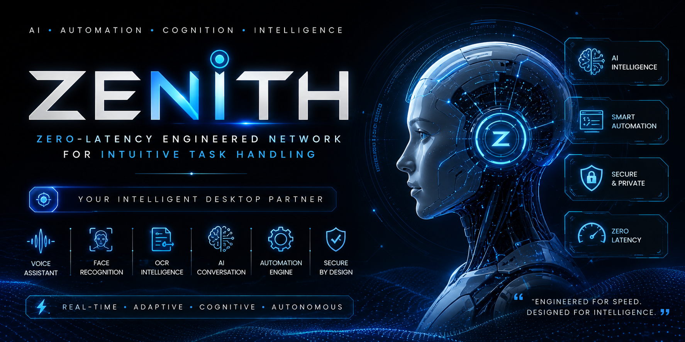

# ZENITH

## Zero-Latency Engineered Network for Intuitive Task Handling

<div align="center">



### Next-Generation AI Desktop Automation & Cognitive Computing System

---


---

### “Transforming traditional desktop automation into intelligent cognitive interaction.”

</div>

---

# Overview

ZENITH is a high-performance AI-powered desktop intelligence platform engineered for autonomous interaction, real-time automation, adaptive memory processing, and computer vision integration.

Unlike traditional assistants, ZENITH operates as a modular cognitive system capable of:

* Understanding natural language
* Executing intelligent workflows
* Automating desktop operations
* Interacting through voice
* Performing biometric authentication
* Processing visual information
* Maintaining contextual memory

ZENITH combines AI orchestration, automation engineering, and cognitive computing into a unified desktop intelligence framework.

---

# Core Capabilities

<div align="center">

| AI Intelligence   | Automation         | Computer Vision       | Productivity          |
| ----------------- | ------------------ | --------------------- | --------------------- |
| Conversational AI | Desktop Automation | Face Recognition      | Email Automation      |
| Intent Detection  | Browser Control    | OCR Processing        | Workflow Automation   |
| Context Memory    | App Management     | Identity Verification | Information Retrieval |
| Dynamic Responses | System Commands    | Visual Processing     | Smart Utilities       |

</div>

---

# System Architecture

```text
                                     ┌──────────────────────┐
                                     │      USER INPUT      │
                                     │ Voice / Text / Face  │
                                     └──────────┬───────────┘
                                                │
                           ┌────────────────────┴────────────────────┐
                           │                                         │
                  ┌────────▼────────┐                       ┌────────▼────────┐
                  │ Speech Engine   │                       │ Vision Engine   │
                  │ STT / TTS       │                       │ OCR / Face AI   │
                  └────────┬────────┘                       └────────┬────────┘
                           │                                         │
                           └────────────────┬────────────────────────┘
                                            │
                                 ┌──────────▼──────────┐
                                 │ Intent Classifier   │
                                 │ NLP Understanding   │
                                 └──────────┬──────────┘
                                            │
                          ┌─────────────────┼─────────────────┐
                          │                 │                 │
                 ┌────────▼───────┐ ┌──────▼────────┐ ┌──────▼────────┐
                 │ Task Resolver  │ │ Memory Engine │ │ AI Brain Core │
                 │ Command Router │ │ Context Store │ │ LLM Interface │
                 └────────┬───────┘ └──────┬────────┘ └──────┬────────┘
                          │                 │                 │
                          └─────────────────┼─────────────────┘
                                            │
                               ┌────────────▼────────────┐
                               │ Execution Orchestrator │
                               │ Automation Controller  │
                               └────────────┬────────────┘
                                            │
      ┌─────────────────────────────────────┼─────────────────────────────────────┐
      │                                     │                                     │
┌─────▼─────┐                     ┌─────────▼────────┐                  ┌────────▼────────┐
│ Browser   │                     │ System Controls  │                  │ Communication   │
│ Automation│                     │ Power / Apps     │                  │ Email / Message │
└───────────┘                     └──────────────────┘                  └─────────────────┘
```

---

# Advanced Features

# 🎙️ Intelligent Voice Interaction

* Real-time speech recognition
* Human-like voice responses
* Wake-word activation
* Multi-command understanding
* Context-aware conversations
* Dynamic response generation

---

# 🧠 AI Cognitive Engine

ZENITH integrates advanced AI reasoning pipelines for:

* Intent classification
* Context retention
* Conversational processing
* Decision making
* Intelligent routing
* Workflow orchestration

### AI Processing Pipeline

```text
Input
  ↓
Speech/Text Processing
  ↓
Intent Detection
  ↓
Context Mapping
  ↓
Decision Engine
  ↓
Task Execution
  ↓
Response Generation
```

---

# 👤 Facial Authentication System

A real-time biometric authentication layer powered by computer vision.

### Features

* Live face recognition
* Identity verification
* Authentication sessions
* Adaptive confidence matching
* Secure profile management

### Authentication Workflow

```text
Camera Feed
     ↓
Face Detection
     ↓
Feature Encoding
     ↓
Recognition Engine
     ↓
Identity Validation
```

---

# 📷 OCR & Visual Intelligence

Extracts structured information from visual data.

### Supported Inputs

* Images
* Screenshots
* Camera feeds
* Documents
* Live visual streams

### OCR Pipeline

```text
Image Input
    ↓
Preprocessing
    ↓
Text Localization
    ↓
OCR Recognition
    ↓
Structured Output
```

---

# ⚡ Autonomous Automation Engine

ZENITH can autonomously interact with the operating system.

### Automation Capabilities

* Application launching
* File management
* Browser interaction
* Keyboard automation
* Mouse automation
* Media control
* Process management
* Workflow execution

---

# 🌐 Browser Intelligence Layer

* Smart browsing
* Automated searching
* Website interaction
* Dynamic navigation
* Information extraction
* Tab management

---

# 💬 Communication System

### Messaging Automation

* Email workflows
* WhatsApp automation
* Notification management
* Automated communication pipelines

---

# 🧠 Adaptive Memory Engine

ZENITH maintains contextual intelligence across interactions.

| Memory Layer     | Function                    |
| ---------------- | --------------------------- |
| Session Memory   | Temporary context retention |
| User Memory      | Personalized adaptation     |
| Task Memory      | Workflow persistence        |
| AI Context Store | Conversation continuity     |

---

# Project Structure

```bash
ZENITH/
│
├── ai/
│   ├── brain/
│   ├── conversation/
│   ├── reasoning/
│   └── response_engine/
│
├── core/
│   ├── executor/
│   ├── orchestrator/
│   ├── router/
│   └── engine/
│
├── modules/
│   ├── automation/
│   ├── browser/
│   ├── communication/
│   ├── media/
│   ├── system/
│   └── utilities/
│
├── vision/
│   ├── face_recognition/
│   ├── OCR/
│   └── processing/
│
├── memory/
│   ├── context/
│   ├── sessions/
│   └── storage/
│
├── security/
│   ├── authentication/
│   ├── permissions/
│   └── monitoring/
│
├── assets/
├── samples/
├── registered_profiles/
│
├── main.py
├── OCR.py
├── requirements.txt
├── .env
└── README.md
```

---

# Technology Stack

# Core Technologies

* Python 3.10+
* Groq API
* Gemini API
* OpenCV
* SpeechRecognition
* pyttsx3
* PyAutoGUI
* psutil

---

# AI & NLP

* Intent Classification
* Conversational Processing
* Context Management
* Dynamic Response Generation

---

# Computer Vision

* Face Recognition
* OCR Processing
* Live Camera Interaction
* Visual Analysis

---

# Installation

# 1. Clone Repository

```bash
git clone https://github.com/Manikanta1216/ai-daemon.git

cd ai-daemon
```

---

# 2. Create Virtual Environment

## Windows

```bash
python -m venv venv

venv\Scripts\activate
```

## Linux / macOS

```bash
python3 -m venv venv

source venv/bin/activate
```

---

# 3. Install Dependencies

```bash
pip install -r requirements.txt
```

---

# Environment Configuration

Create a `.env` file in the root directory.

```env
PRIMARY_AI_PROVIDER=groq

GROQ_API_KEY=
GEMINI_API_KEY=

GROQ_MODEL=llama-3.3-70b-versatile
GEMINI_MODEL=gemini-2.0-flash

ACTIVATION_PHRASE=zenith

FACE_AUTHENTICATION_ENABLED=true

SMTP_EMAIL=
SMTP_PASSWORD=
```

---

# Running ZENITH

```bash
python main.py
```

---

# Face Recognition Setup

## Generate Samples

```bash
python vision/SampleGenerator.py
```

## Train Recognition Model

```bash
python vision/ModelTrainer.py
```

---

# OCR Module

```bash
python OCR.py
```

---

# Security Configuration

Recommended `.gitignore`

```gitignore
venv/
.env
__pycache__/
*.pyc
```

### Security Best Practices

* Never expose API keys
* Remove sensitive datasets
* Use environment variables
* Enable safe execution mode
* Avoid committing personal files

---

# Engineering Principles

ZENITH is engineered around:

* Modular architecture
* Scalable systems
* Low-latency execution
* Cognitive interaction
* Autonomous workflows
* Extensible design patterns

---

# Future Roadmap

## Planned Enhancements

* GUI Dashboard
* Local LLM Integration
* Multi-Agent Coordination
* Plugin Ecosystem
* Smart Home Integration
* Autonomous Planning Engine
* Real-Time Analytics
* Neural Memory System
* Cross-Device Synchronization

---

# Research Domains

* Artificial Intelligence
* Human Computer Interaction
* Cognitive Computing
* Desktop Automation
* Computer Vision
* Intelligent Systems
* Voice Computing

---

# Contributing

Contributions are welcome from developers, researchers, and automation engineers.

```bash
1. Fork Repository
2. Create Feature Branch
3. Commit Changes
4. Push Updates
5. Open Pull Request
```

---

# License

MIT License © ZENITH Labs

---

# Developer

## 👨‍💻 ZENITH Labs

### AI Systems • Cognitive Automation • Intelligent Computing

GitHub:

[Manikanta1216 GitHub](https://github.com/Manikanta1216?utm_source=chatgpt.com)

---

# Final Statement

> ZENITH represents the evolution of desktop interaction —
> combining AI reasoning, automation engineering, and cognitive computing into one intelligent autonomous platform.

<div align="center">

# ⚡ ZENITH

## Autonomous Intelligence For The Modern Desktop

</div>
